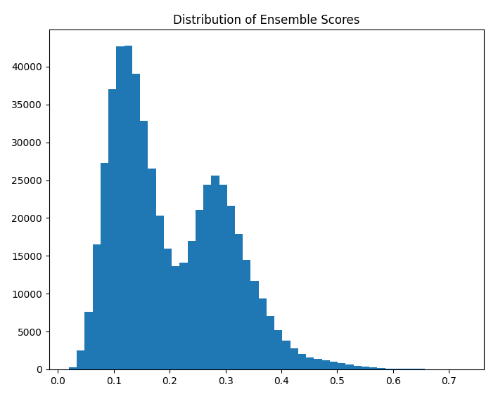

# Project Overview: fraud_data_analysis
This project implements an ensemble approach to detect fraudulent credit card transactions using multiple anomaly detection algorithms. The script is designed to use unsupervised machine learning models to identify anomalous transaction data that may indicate fraudulent activity.

## Project Structure
The project structure is shown below. Contents of the `data` directory is not included in the repository due to file size limitations. 

```bash
.
├── data
│   ├── cc-transactions-project.csv
│   ├── cc-transactions-test-project.csv
│   └── project-dataset.zip
├── images
│   ├── image-10.png
│   ├── image-1.png
│   ├── image-2.png
│   ├── image-3.png
│   ├── image-4.png
│   ├── image-5.png
│   ├── image-6.png
│   ├── image-7.png
│   ├── image-8.png
│   ├── image-9.png
│   └── image.png
├── output
│   ├── output.csv
│   └── output.png
├── README.md
├── requirements.txt
└── scripts
    ├── eda.ipynb
    └── main.py
```


## Features
- Multi-model Ensemble Approach: Combines results from Isolation Forest, One-Class SVM, Local Outlier Factor, HDBSCAN, and Z-score
- Feature Engineering: Creates specialized features including time patterns, age verification, and transaction velocity
- Unsupervised Learning: Doesn't require labeled fraud examples for training
- Normalized Scoring: Combines multiple anomaly scores into a unified ensemble score
- Threshold-based Classification: Uses quantile-based thresholding (99th percentile) to identify potential fraud


## Installation & Execution
To install and run the analysis script please perform the following:

```bash
# setup a virtual environment
# this was developed with python 3.11
pyenv activate 3.11.0.venv
python3 -m pip install -r requirements.txt

# execute our script
python3 scripts/main.py -i data/ -o output/
```

## Output
The script will generate predictions and output a file with an `is_fraud` column indicating potentially fraudulent transactions (1 = fraud, 0 = legitimate). Script output timing:

```bash
training on: 129667 samples
running isolation forest model
        training time: 0.88 seconds
running one-class svm model
        training time: 49.39 seconds
running local outlier factor model
        training time: 9.23 seconds
running hdbscan model
        training time: 46.65 seconds
getting zscores
        training time: 0.00 seconds

testing on: 555719 samples
generating predictions on test data
running isof on test data
        time: 1.06 seconds
running svm on test data
        time: 68.61 seconds
running lof on test data
        time: 20.17 seconds
running hdbscan on test data
        time: 217.77 seconds
running zscore on test data
        time: 0.00 seconds

```

The script will also output the distribution of the ensemble scores. This may be used to finetune the output. 



# Methodology
## Data Preparation and Feature Engineering
The script performs several data preparation steps:
- Extracting time features (hour of day, time categorization)
- Computing purchaser age at transaction time
- Encoding categorical variables
- Calculating time between transactions per card
- Log-transforming transaction amounts
- Standardizing numerical features

## Anomaly Detection Models
Five different anomaly detection techniques are used:
- Isolation Forest: Effective for isolating outliers in high-dimensional spaces
- One-Class SVM: Identifies regions in the feature space where normal transactions occur
- Local Outlier Factor: Detects samples that are locally outlying compared to their neighbors
- HDBSCAN: Density-based clustering to identify points in low-density regions
- Z-score Analysis: Statistical method to detect values far from the mean (applied to log-transformed transaction amounts)

Additional factors like age verification are also incorporated into the ensemble.

## Ensemble Approach
The script creates a unified fraud score by:
- Calculating anomaly scores from each model
- Normalizing scores to the [0,1] range
- Classifying transactions with scores above the 99th percentile as potentially fraudulent

# EDA
## Analysis Findings
Analysis of the training dataset identified the following key findings:
- Bimodal Distribution: Transaction amounts show a bimodal distribution when log-transformed
- Time Anomalies: Some cards had multiple transactions within very short time spans (<30 seconds)
- Off-hour Transactions: Unusual geographic patterns for transactions occurring during unusual hours
- Age Anomalies: Several transactions where the purchaser appears too young to be making a purchase

## Analysis Narrative
Analysis of the file “cc-transactions-project.csv” has uncovered several insights. First, the data contains 1296675 entries with 22 columnar variables. Every column / row contains data and no missing or NA values were observed. The record_number and transaction_number appear to be unique values related to a particular merchant transaction and are most likely uninformative. Analysis of the merchant, category, and job identified 939, 14, and 494 unique categorical values per variable. Likewise, the cc_number variable was found to contain 983 unique values.


Digging a little deeper into the data, the amount variable (shown as Transaction Amount) displays a bi-modal distribution when log transformed. 


There did not appear to be any notable outliers when investigating the transaction counts for merchant category and gender .


The distance between a purchaser and the merchant also appeared normal. 


However, when we look at spending distribution compared to the job type we begin to see some outliers emerge. Looking at the mean purchase amount per job and merchant category we can see that the average purchases is below $200.0.


Moving the analysis into the time domain we can see that some card numbers have multiple transactions within a very short time span ( < 30 seconds).


Adding in a geography component to the purchase time we can see multiple transactions occurring at off peak hours. 


Finally, looking into the dob of the purchaser when compared to the purchase date we see several transactions where the purchaser appears to be too young to be making a purchase. 


